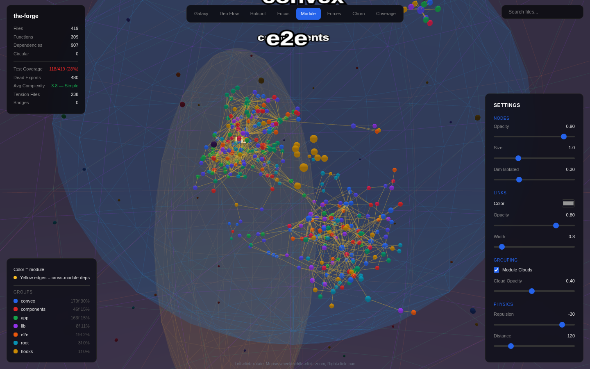
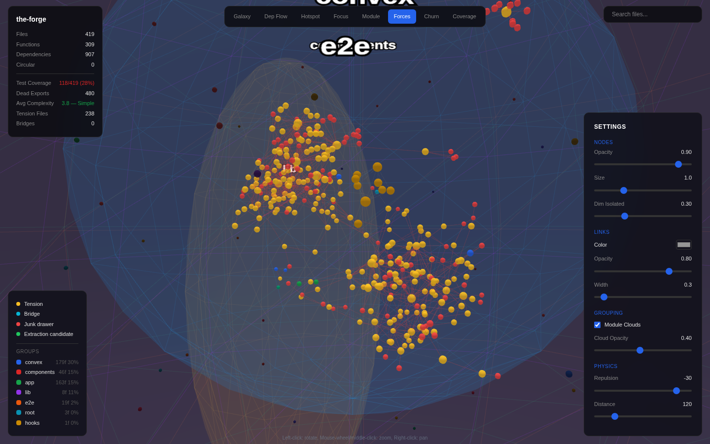

<div align="center">

# codebase-visualizer

**3D interactive codebase visualization for TypeScript projects.**

Parse your codebase, build a dependency graph, compute architectural metrics, and explore it all in an interactive 3D map. Also works as an MCP server for LLM-assisted code understanding.

[](LICENSE)
[](https://nodejs.org)
[](https://www.typescriptlang.org)

</div>

---

## Screenshots

| Galaxy View | Module View | Forces View |
|:-----------:|:-----------:|:-----------:|
|  |  |  |
| 3D force graph, module clouds, group legend | File clusters by directory, labeled clouds | Centrifuge: tension, bridges, candidates |

## Quick Start

```bash
npx codebase-visualizer ./src
```

That's it. Opens a 3D map at `http://localhost:3333`.

## Table of Contents

- [Features](#features)
- [Installation](#installation)
- [Usage](#usage)
- [MCP Integration](#mcp-integration)
- [Browser Views](#browser-views)
- [Metrics](#metrics)
- [REST API](#rest-api)
- [Architecture](#architecture)
- [Requirements](#requirements)
- [Limitations](#limitations)
- [Contributing](#contributing)
- [License](#license)

## Features

- **8 interactive 3D views** — Galaxy, Dependency Flow, Hotspot, Focus, Module, Forces, Churn, Coverage
- **11 architectural metrics** — PageRank, betweenness, coupling, cohesion, tension, churn, complexity, blast radius, dead exports, test coverage, escape velocity
- **3D module clouds** — transparent spheres group files by directory with Phong shading and zoom-based fade
- **MCP server** — 8 tools for LLM-assisted code understanding (Claude Code, Cursor, VS Code)
- **REST API** — 9 endpoints for programmatic access
- **Search** — find any file and fly the camera to it
- **Detail panel** — click any node for full metrics
- **Configurable** — node size, link color, physics, cloud opacity

## Installation

Run directly with npx (no install needed):

```bash
npx codebase-visualizer ./src
```

Or install globally:

```bash
npm install -g codebase-visualizer
codebase-visualizer ./src
```

## Usage

### Browser Mode (default)

```bash
npx codebase-visualizer ./src
# => Parsed 142 files, 387 functions, 612 dependencies
# => 3D map ready at http://localhost:3333
```

### MCP Mode

```bash
npx codebase-visualizer --mcp ./src
```

Starts a stdio MCP server. No browser, no HTTP.

### Options

| Flag | Description | Default |
|------|-------------|---------|
| `<path>` | Path to TypeScript codebase | required |
| `--mcp` | MCP stdio mode | off |
| `--port <n>` | Web server port | `3333` |

## MCP Integration

### Claude Code

Add to `~/.claude/settings.json`:

```json
{
  "mcpServers": {
    "codebase-visualizer": {
      "command": "npx",
      "args": ["codebase-visualizer", "--mcp", "./src"]
    }
  }
}
```

### Cursor / VS Code

Add to `.cursor/mcp.json` or `.vscode/mcp.json`:

```json
{
  "servers": {
    "codebase-visualizer": {
      "command": "npx",
      "args": ["codebase-visualizer", "--mcp", "./src"]
    }
  }
}
```

### MCP Tools

| Tool | What it does |
|------|--------------|
| `codebase_overview` | High-level architecture: modules, entry points, key metrics |
| `file_context` | Everything about one file: exports, imports, dependents, metrics |
| `get_dependents` | Blast radius: what breaks if you change this file |
| `find_hotspots` | Ranked problem files by any metric |
| `get_module_structure` | Module map with cross-deps, cohesion, circular deps |
| `analyze_forces` | Centrifuge analysis: tension, bridges, extraction candidates |
| `find_dead_exports` | Unused exports that can be safely removed |
| `get_groups` | Top-level directory groups with aggregate metrics |

## Browser Views

| View | What it shows |
|------|---------------|
| **Galaxy** | 3D force-directed graph. Color = module, size = PageRank |
| **Dep Flow** | DAG layout (top-to-bottom). Circular deps in red |
| **Hotspot** | Health heatmap: green (healthy) to red (high coupling) |
| **Focus** | Click a node to see its 2-hop neighborhood |
| **Module** | Files cluster by directory. Cross-module edges in yellow |
| **Forces** | Centrifuge: tension (yellow), bridges (cyan), extraction (green) |
| **Churn** | Git commit frequency heatmap |
| **Coverage** | Test coverage: green = tested, red = untested |

### Module Clouds

Transparent 3D spheres group files by top-level directory:

- Phong shading + wireframe for depth perception
- Zoom-based opacity fade
- Smart grouping: `src/components/ui/` becomes "components"
- Toggle via Settings > "Module Clouds"

### Group Legend

Bottom-left legend shows view-specific color coding. When clouds are enabled, adds color swatch + group name + file count + importance % for up to 8 groups sorted by PageRank.

## Metrics

| Metric | What it reveals |
|--------|-----------------|
| **PageRank** | Most-referenced files (importance) |
| **Betweenness** | Bridge files between disconnected modules |
| **Coupling** | How tangled a file is (fan-out / total connections) |
| **Cohesion** | Does a module belong together? (internal / total deps) |
| **Tension** | Is a file torn between modules? (entropy of cross-module pulls) |
| **Escape Velocity** | Should this module be its own package? |
| **Churn** | Git commit frequency |
| **Complexity** | Average cyclomatic complexity of exports |
| **Blast Radius** | Transitive dependents affected by a change |
| **Dead Exports** | Unused exports (safe to remove) |
| **Test Coverage** | Whether a test file exists for each source file |

## REST API

| Endpoint | Returns |
|----------|---------|
| `GET /api/graph` | All nodes + edges + stats |
| `GET /api/groups` | Group metrics sorted by importance |
| `GET /api/forces` | Force analysis (cohesion, tension, bridges) |
| `GET /api/modules` | Module-level metrics |
| `GET /api/hotspots?metric=coupling&limit=10` | Ranked hotspot files |
| `GET /api/file/<path>` | Single file details + metrics |
| `GET /api/meta` | Project name |
| `GET /api/ping` | Health check |
| `POST /api/mcp` | MCP tool invocation (web mode) |

## Architecture

```
codebase-visualizer <path>
        |
        v
   +---------+     +---------+     +----------+     +---------+
   | Parser  | --> | Graph   | --> | Analyzer | --> | Server  |
   | TS AST  |     | grapho- |     | metrics  |     | Next.js |
   |         |     | logy    |     |          |     | or MCP  |
   +---------+     +---------+     +----------+     +---------+
```

1. **Parser** — extracts files, functions, and imports via the TypeScript Compiler API. Resolves path aliases, respects `.gitignore`, detects test associations.
2. **Graph** — builds nodes and edges with [graphology](https://graphology.github.io/). Detects circular deps via iterative DFS.
3. **Analyzer** — computes all 11 metrics plus group-level aggregations.
4. **Server** — serves the 3D visualization via [Next.js](https://nextjs.org/) + [3d-force-graph](https://github.com/vasturiano/3d-force-graph), or exposes queries via MCP stdio.

## Requirements

- Node.js >= 18
- TypeScript codebase (`.ts` / `.tsx` files)

## Limitations

- TypeScript only (no JS CommonJS, Python, Go, etc.)
- Static analysis only (no runtime/dynamic imports)
- File + exported function granularity (no internal function calls)
- Client-side 3D requires WebGL

## Release

Publishing is automated and **only happens on `v*` tags**.

### One-time setup

1. Create an npm automation token (npmjs.com → Access Tokens).
2. Add it to GitHub repository secrets as `NPM_TOKEN`.

### Normal CI (before release)

- `CI` workflow runs on every PR and push to `main`:
  - lint → typecheck → build → test

### Create a release (auto bump + PR + auto tag)

1. Open GitHub Actions → `Release PR`.
2. Click **Run workflow** on `main`.
3. Select bump type: `patch` | `minor` | `major`.
4. Merge the generated release PR.

`Release PR` will:
- run lint → typecheck → build → test
- bump `package.json` version
- open a release PR assigned to the workflow runner

After merge, `Tag Release` creates and pushes `vX.Y.Z`, which triggers `Publish to npm`.

## Contributing

Contributions are welcome. Please open an issue first to discuss what you'd like to change.

```bash
git clone https://github.com/bntvllnt/codebase-visualizer.git
cd codebase-visualizer
pnpm install
pnpm dev          # tsx watch mode
pnpm test         # vitest
pnpm lint         # eslint
pnpm typecheck    # tsc --noEmit
pnpm build        # production build
```

## License

[MIT](LICENSE)
